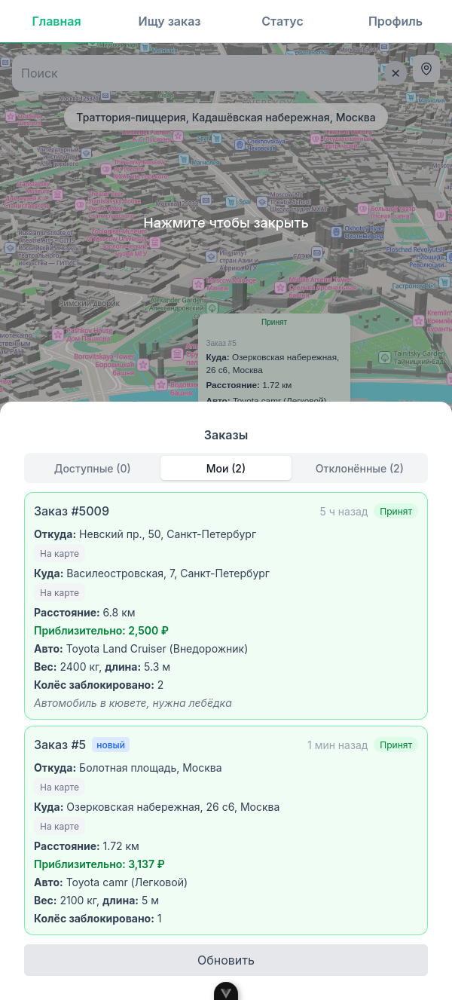
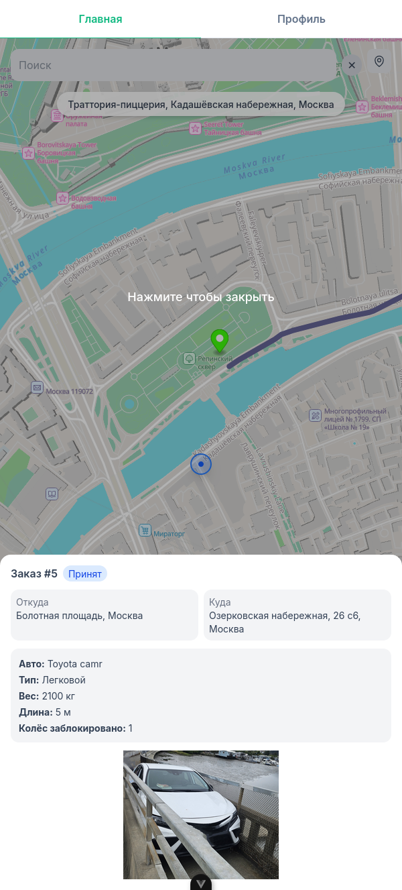
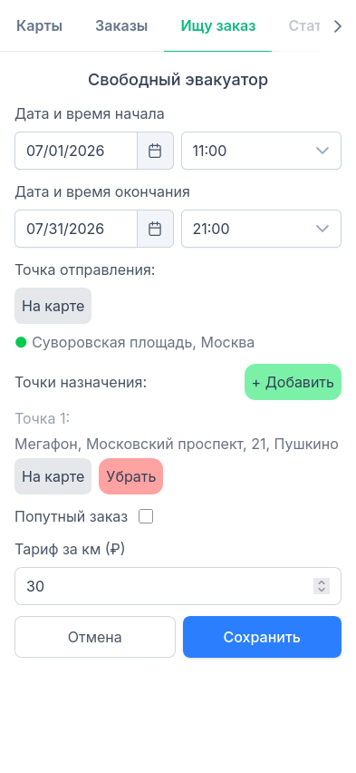

# GeoMove

Открытая гео-платформа для поиска водителей эвакуаторов и грузоперевозок.

[geomove.online](https://geomove.online) | [driver.geomove.online](https://driver.geomove.online)

Приложения для Android: **[перейти на страницу для скачивания](https://github.com/SallimanR/GeoMove_Public/releases/tag/pre-release_1)** -> скачать apk приложения для пользователей/водителей -> найти apk в загрузках браузера или в папке Downloads -> запустить apk

IOS версии нельзя скачать через GitHub из-за ограничений установленных Apple и IOS

Авторизация через Telegram может не работать без VPN из-за блокировок

## Создание и отслеживание заказа

  
   
  Пользователь выбирает локацию отправки и прибытия, создаёт заказ

  
   
  Водитель видит поступивший заказ в своём приложении

  
   
  Водитель принимает заказ — статус меняется в реальном времени

  
   
  Пользователь получает уведомление и видит обновлённый статус заказа

  
   
  Водитель создаёт заявку на свободный эвакуатор

  
   
  Созданная заявка на свободный эвакуатор

---

### Библиотеки для использования в сторонних проектах
- #### [Maps npm package](https://www.npmjs.com/package/@geomove/maps) | [docs](./frontend/packages/maps/README.md)
- #### [Geo utilities npm package](https://www.npmjs.com/package/@geomove/go) | [docs](./frontend/packages/geo/README.md)

### Geo API:
- https://geomove.online/style/style/style.json — стиль карт (style.json)
- https://geomove.online/tiles — PMTiles API (тайлы карт)
- https://geomove.online/geocoding — геопоиск и обратная геокодировка
- https://geomove.online/routing — построение маршрутов и map matching

## Лицензия

Проект использует двойное лицензирование:

| Компонент | Лицензия |
|---|---|
| Backend, бизнес-логика, домены |  |
| [Карты (@geomove/maps)](./frontend/packages/maps) |  |
| [Гео-утилиты (@geomove/geo)](./frontend/packages/geo) |  |

Карты и гео-утилиты распространяются под MIT — используйте в любых проектах, включая коммерческие.

---

### Для разработки и участия:
- [DEVELOPING.md](./DEVELOPING.md)
- [Документация](./docs/)
