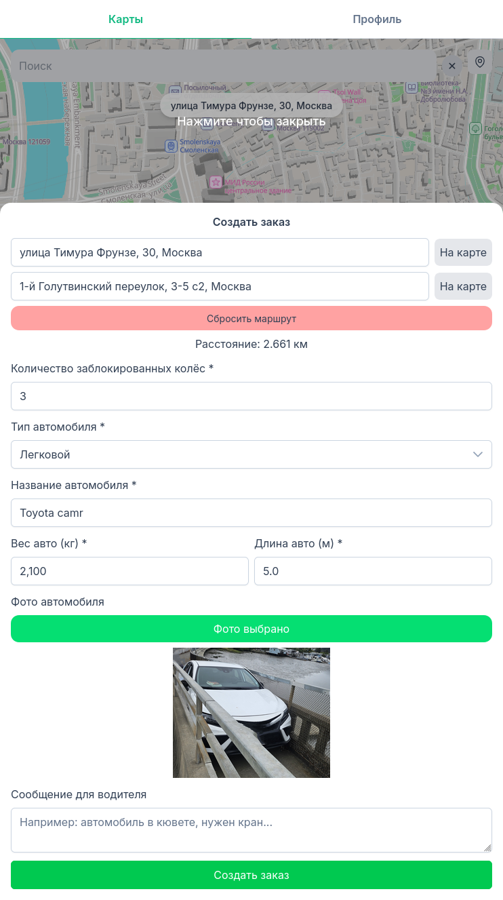
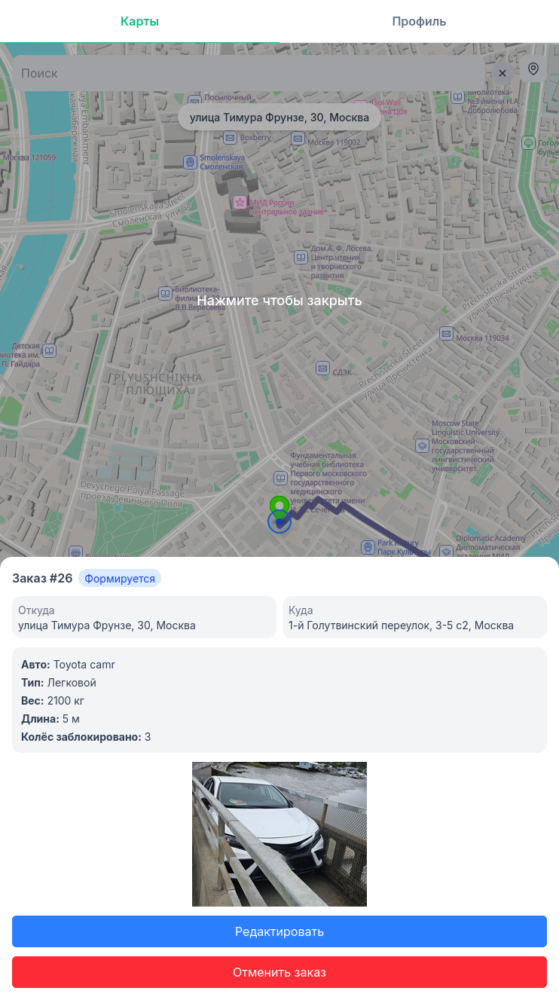

# GeoMove

Открытая гео-платформа для поиска водителей эвакуаторов и грузоперевозок.
[geomove.online](https://geomove.online) | [driver.geomove.online](https://driver.geomove.online)

## Создание и отслеживание заказа

  
   
  <em>Пользователь выбирает локацию отправки и прибытия, создаёт заказ</em>

  
   
  <em>Водитель видит поступивший заказ в своём приложении</em>

  
   
  <em>Водитель принимает заказ — статус меняется в реальном времени</em>

  
   
  <em>Пользователь получает уведомление и видит обновлённый статус заказа</em>

---

### Библиотеки для использования в сторонних проектах
- #### [Maps npm package](https://www.npmjs.com/package/@geomove/maps) | [docs](./frontend/packages/maps/README.md)
- #### [Geo utilities npm package](https://www.npmjs.com/package/@geomove/go) | [docs](./frontend/packages/geo/README.md)

### Geo API:
- https://geomove.online/style/style/style.json — стиль карт (style.json)
- https://geomove.online/tiles — PMTiles API (тайлы карт)
- https://geomove.online/geocoding — геопоиск и обратная геокодировка
- https://geomove.online/routing — построение маршрутов и map matching

### Для разработки и участия:
- [DEVELOPING.md](./DEVELOPING.md)
- [Документация](./docs/)
